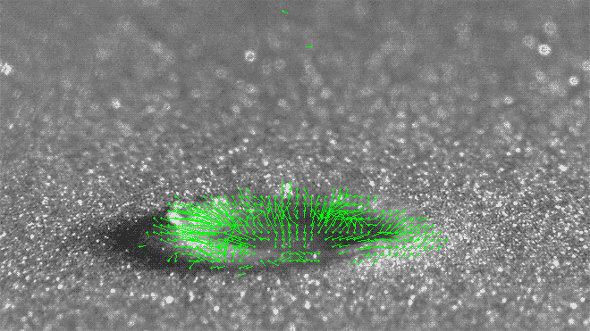

# Dense Optical Flow with OpenCV

This project demonstrates how to use OpenCV to detect and visualize dense optical flow in video streams. The code processes video frames to calculate the motion of objects between consecutive frames.

## How It Works

### Motion Detection

The code uses the Farneback method to calculate dense optical flow. This method estimates the motion of each pixel between two consecutive frames. The motion is represented as a vector field, where each vector indicates the direction and magnitude of motion for a pixel.

### Calculating Flow Vectors

The `cv2.calcOpticalFlowFarneback` function in OpenCV calculates the flow vectors from the pixel values of two consecutive frames. It works by approximating the pixel intensities in the neighborhood of each pixel and solving for the displacement vector that minimizes the difference between the two frames. This results in a dense flow field where each pixel has a corresponding flow vector.

### Calculating Magnitude and Direction

1. **Magnitude**: The magnitude of motion is calculated using the Euclidean norm of the flow vectors. This represents the speed of motion.
2. **Direction**: The direction of motion is calculated using the arctangent of the flow vectors. This represents the angle of motion.

### Processing Pixel Values

The code processes pixel values to visualize the motion:
- **draw_flow**: This function draws the motion vectors on the image. It filters out vectors below a certain threshold and scales the remaining vectors for visualization.
- **draw_hsv**: This function converts the flow vectors to an HSV image, where the hue represents the direction and the value represents the magnitude of motion.

### HSV Maps and Motion Vectors

- **HSV Maps**: HSV (Hue, Saturation, Value) maps are used to represent the flow vectors visually. The hue represents the direction of motion, the saturation is set to maximum, and the value represents the magnitude of motion.
- **Motion Vectors**: Motion vectors are arrows that indicate the direction and magnitude of motion for each pixel. They are calculated from the flow vectors and can be visualized on the image.

### Code Details

For detailed code implementation, refer to the following files:
- [denseopticalOpenCV.ipynb](denseopticalOpenCV.ipynb)

## Example Usage

The code can process both live video streams from a webcam and pre-recorded video files. It displays the motion vectors and the HSV representation of the flow in real-time.

```python
# Example of processing live video stream
cap = cv2.VideoCapture(0)
suc, prev = cap.read()
prevgray = cv2.cvtColor(prev, cv2.COLOR_BGR2GRAY)

while True:
    suc, img = cap.read()
    gray = cv2.cvtColor(img, cv2.COLOR_BGR2GRAY)
    flow = cv2.calcOpticalFlowFarneback(prevgray, gray, None, 0.5, 5, 15, 3, 7, 1.5, 0)
    prevgray = gray
    cv2.imshow('flow', draw_flow(gray, flow, step=8, threshold=1.0))
    cv2.imshow('flow HSV', draw_hsv(flow))
    if cv2.waitKey(5) == ord('q'):
        break

cap.release()
cv2.destroyAllWindows()
```

This example captures video from the webcam, calculates the optical flow, and displays the motion vectors and HSV representation in real-time.

## Sample Frames

Here is a sample frame from `OutputPlop.gif` demonstrating the motion vectors:



## Raw Input and Output Files

- **Input GIF**: 
- **Output GIF**: 
- **Input Video**: 
- **Output GIF**: 

(The output gifs do not play back on loop so you might want to refresh the page to view them again)
